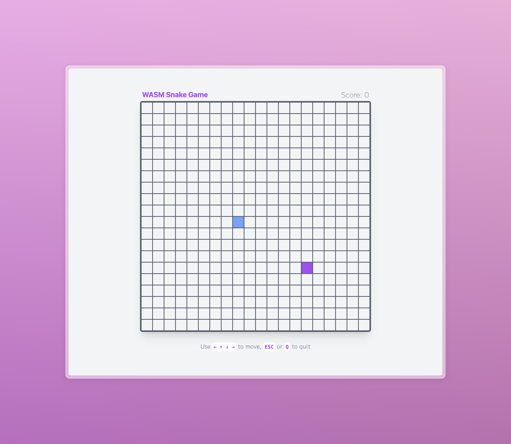
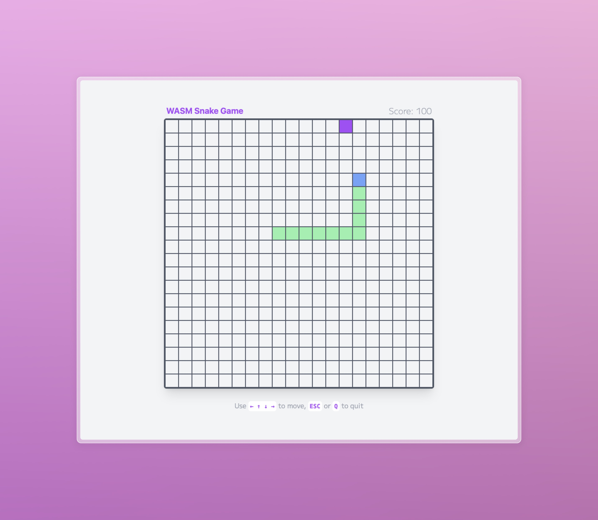
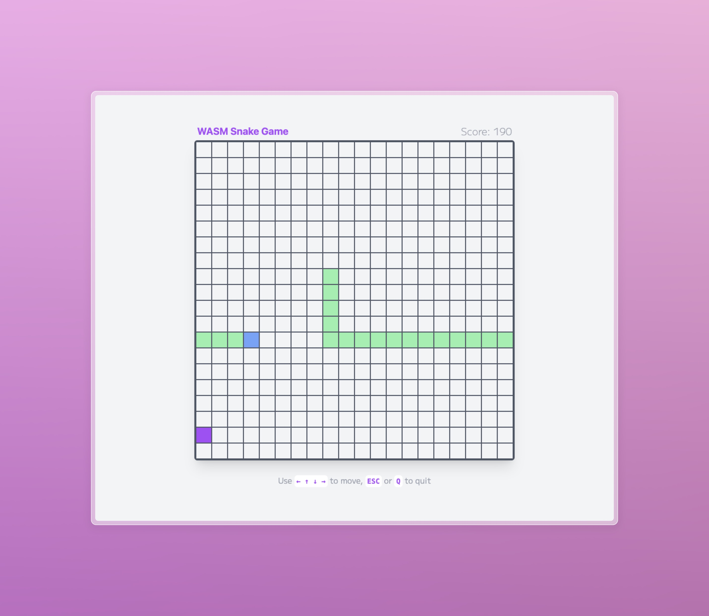
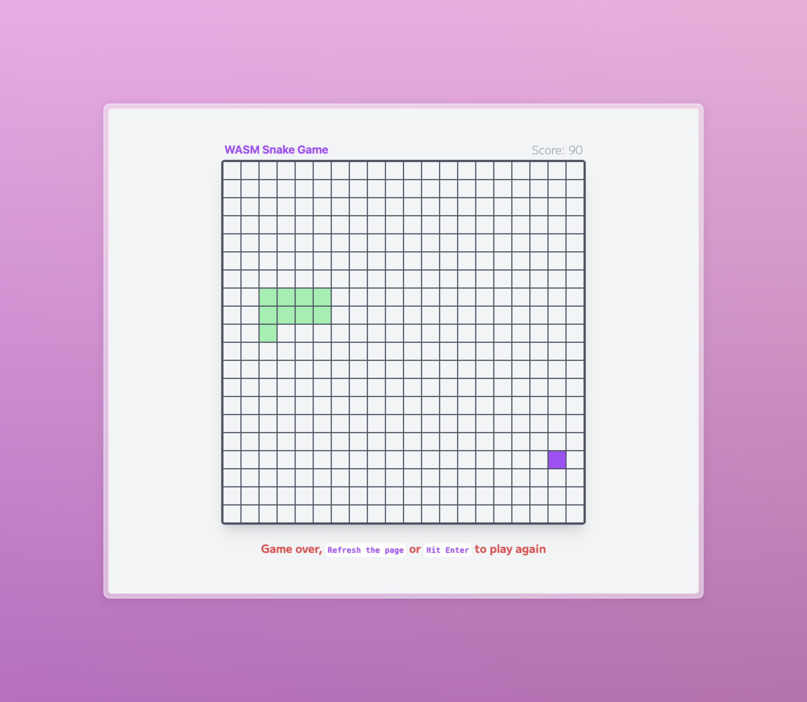

# 🐍 🌐 WASM Snake Game
A simple snake game built with C and Javascript via WebAssembly (WASM).

# 🕹️ Try it out
[visit `wasm-snake-game.vercel.app`](https://wasm-snake-game.vercel.app)

# ⚡ Powered by
- **Sweet Wu** (The reason I make this game)
- **Emscripten (emcc)** for compiling C to WASM 
- **Vercel** for hosting
- **Tailwind CSS** for styling

# 🔨 Development
1. Clone this repository
2. Install [Emscripten](https://emscripten.org/docs/getting_started/downloads.html)
3. Run the `build.sh` script
4. Finally, run a server what ever you like (Ex: python or live-server)

# 📸 Demo

| Info       | Screenshot |
|-------------------|-------|
| Initial State     |  |
| Moving            |  |
| Pass Through Wall      |  |
| Hit it self Game Over         |  |